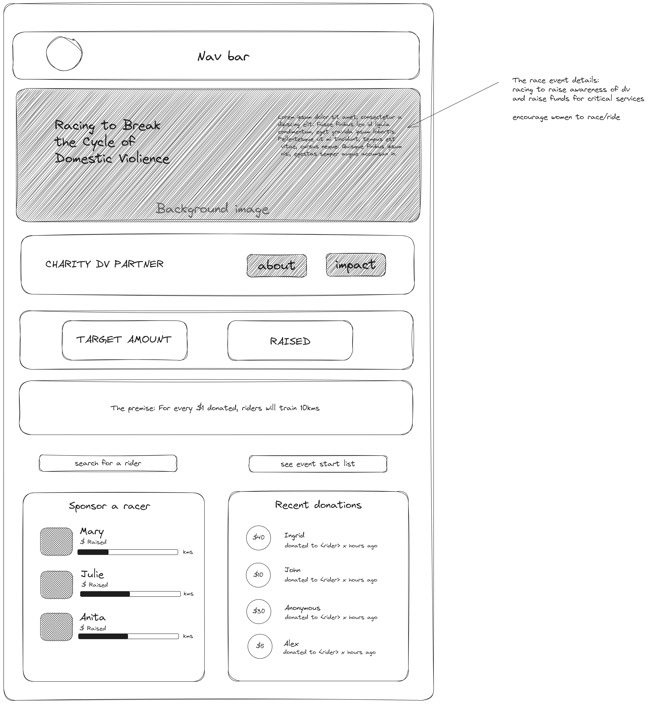

# Racing to Break the Cycle of Domestic Violence (Back End)
 
by Maya Dominice

She Codes Plus crowdfunding project - DRF Backend.


## Deployment

Deployed on [Fly.io](https://fly.io/) and endpoint available here:
https://breakingthecycle-backend.fly.dev/

## Planning

### Concept/Name

The concept for this was inspired by my experiences in cycling racing and observing the barriers that women often face in sport and in the community. One of the key races on the cycling calendar is a fundraising event to raise money and awareness about domestic violence, which touches the lives of so many, including women who cycle and race and is one of the biggest women's races on the calender in terms of participation.

<p align="center">


</p>

Currently, women's participation in cycling and racing remains riddled with diffulty/barriers, like so many other male-dominated sports. Everything ranging from outright hostile/unwelcoming behaviour in races/rides to lack of recognition to vastly unequal prize money. 

Yet cycling remains a key mechanism to help women move autonomously, freely, cheaply whilst improving fitness and wellbeing - and is an amazing vehicle to bring women together across spaces. 

To that end, this fundraising concept is a pivot on an existing model (Sisters of the Saddle: https://sistersofthesaddle.com/) with an application to this key race event.

The crowdfunding site will feature information about the event, and the dedicated domestic violence charities funds are being raised for and the target sum the event wants to raise for the charities.

The premise for donations will be that for each dollar donated, the racing women will train x number of kilometers in preparation/solidarity and fitness acheivement goal.

Women who sign up for the race get a 'rider' account created on the fundraising site, where they can set the target (or max) kms they want to ride, along with the rate per dollar they're willing to challenge themselves with.

When certain collective kms thresholds are acheived in the lead up to the event, the club behind the event can run sessions that the riders/women want eg:
- coached bike skills
- coached racing skills
- ride with an ex-professional woman racer
- social/learn to ride with the families/victims of dv (if willing)

Sponsors/donors can donate to riders or to directly to the DV charities nominated.

### Intended Audience/User Stories

Target fundraisers are women who are either already cycling and racing and seeking support/community to get more confident on the bike and in racing (whilst also riding for a good cause)

Target sponsorhips/donors would be the broader community, businesses or any entity wanting to make a difference in supporting victims and families of domestic violence and work being done to end the cycle of violence; as well as supporting women's participation in sport and their journey towards healthier lifestyles.


### Front End Pages/Functionality

#### Homepage

* [ ] Navigation bar to
  * [ ] Sign in/sign out
  * [ ] Create an account
* [ ] Fundraising target / fundraising amount reached
* [ ] Search for a rider
* [ ] See all riders
* [ ] List of riders (leaderboard)
  * [ ] Kms ridden/kms target
  * [ ] Amount raised/amount target
* [ ] List of recent donations
  * [ ] Amount
  * [ ] First name
  * [ ] Who donated to
  * [ ] Time since donated

#### Rider Page
* [ ] Showing various aspects of rider including:
  * [ ] Avatar image, background image
  * [ ] Bio/description
  * [ ] Selected rate of $ to kms (1, 2, 5, 10)
  * [ ] Target kms, amount
  * [ ] Amount ridden, raised
* [ ] Show donations list
* [ ] Show updates list which includes
  * [ ] kms ridden
  * [ ] description
  * [ ] images

#### User/account Page
* [ ] Show/update standard user profile information
  * [ ] Name
  * [ ] Email
  * [ ] Avatar
* [ ] Create a rider page (can only create one per account)
* [ ] If have rider page, show:
  * [ ] Donations received
  * [ ] Post an update
  * [ ] Show/edit updates
* [ ] Donations made (if any)
  * [ ] Option to withraw/delete donation

### API Spec

| HTTP Method | Url | Purpose | Request Body | Successful Response Code | Authentication <br /> Authorization | Status/Comments |
| --- | ------- | ------ | -- | -----| ----|------|
| GET | /riders/ | Return all riders | N/A | 200 | N/A | Implemented |
| GET | /rider/1 | Returns the rider with ID of '1' (Rider detail page) and all associated information, updates and donations | N/A | 200 | N/A | Implemented |
| GET | /donations/ | Returns all donations | N/A | 200 | N/A | Implemented |
| DELETE | /donation/1 | Deletes a donation | N/A | 204 | User logged in must be donation owner | Partially completed - permissions not implemented yet |
| GET | /users/ | Return all users| N/A | 200 | User logged in must be admin user. | Partially completed - permissions not implemented yet |
| GET | /user/1 | Return user with ID of '1' | N/A | 200 | User of ID '1' must be logged in. | Partially completed - permissions not implemented yet |
| PUT | /user/1 | Update user with ID of '1' | N/A | 200 | User of ID '1' must be logged in. | Not implemented yet |
| POST | /users/ | Create new user | Example request body:<br> ```{"username":"UserName", "email":"emailaddress", "password":"yourpassword" }```<br>| 201 | N/A | Implemented |
| POST | /riders/ | Create a new rider profile | Example request body: <br /> ```{"team":"Movistar", "bio":"I'm riding to raise funds", "avatar_image":"https://exampleimage.jpg", "background_image":"https://exampleimage.jpg", "is_active":true, "rate":"1", "kms_ceiling":500}``` Valid values for rate are: 1, 2, 5. <br /> | 201 | User must be logged in/authorized (via token); user can only create one rider profile/item. | Implemented |
| POST | /updates/ | Rider can create a progress update item | Example request body: <br /> ```{"description":"This was a hard week of riding, I did lots of kms.", "image":"https://me_on_my_bike.jpg", "kms_ridden":20}``` <br /> | 201 | User must be logged in/authorized (via token) and the owner of the rider profile. | Implemented |


## Database Schema
The fields and tables relating to the goals arent't yet deployed - planning to try and include this so that users can create a project with three subtype goals - financial, time/skills and items - as often a community project takes on all these elements - eg for a community garden, some people can offer goods like soils, straw or seedlings, others can offer skills/time such as building a garden bed and others can offer money to purchase items such as soil, irrigation piping etc.

  

## Wireframes
Some initial concepts for the layout - designed in mobile view. 




## Colour Scheme

TBD


## Fonts

Planning to implement Google font pairings at this stage, such as this one:
https://www.fontpair.co/pairings/poiret-one-montserrat

- Headers: Poiret
- Body: Monserrat

